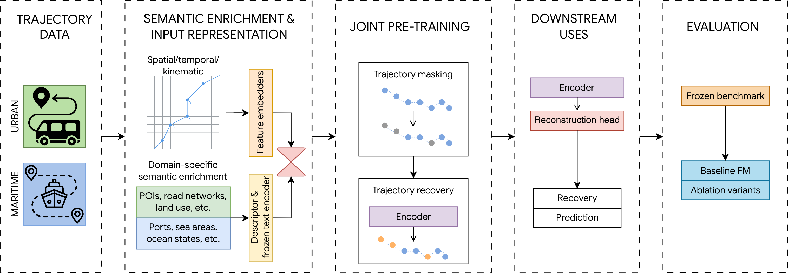
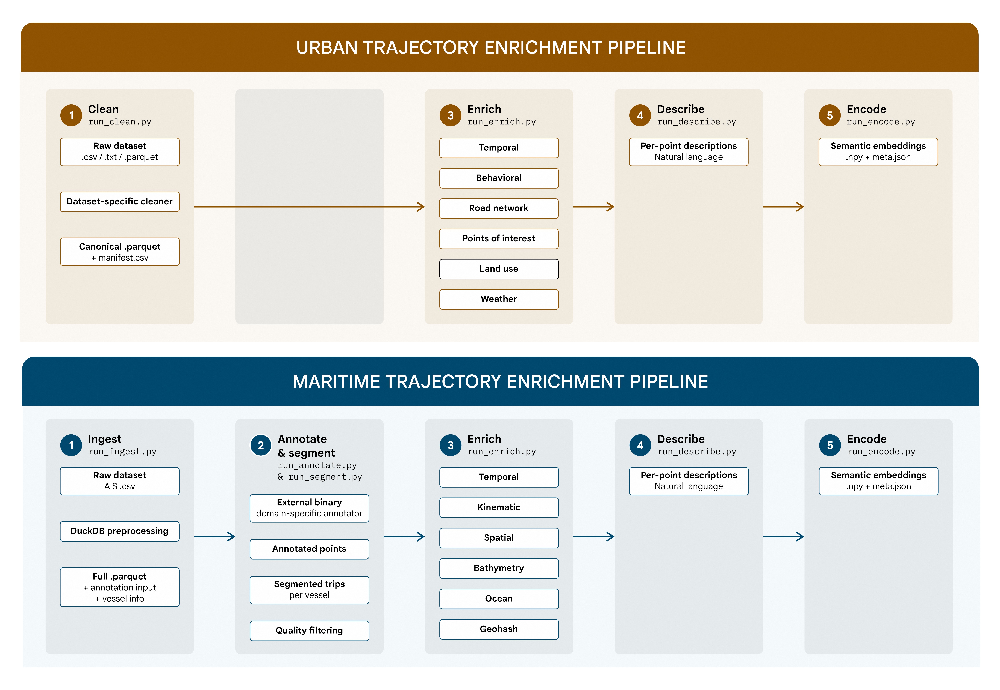
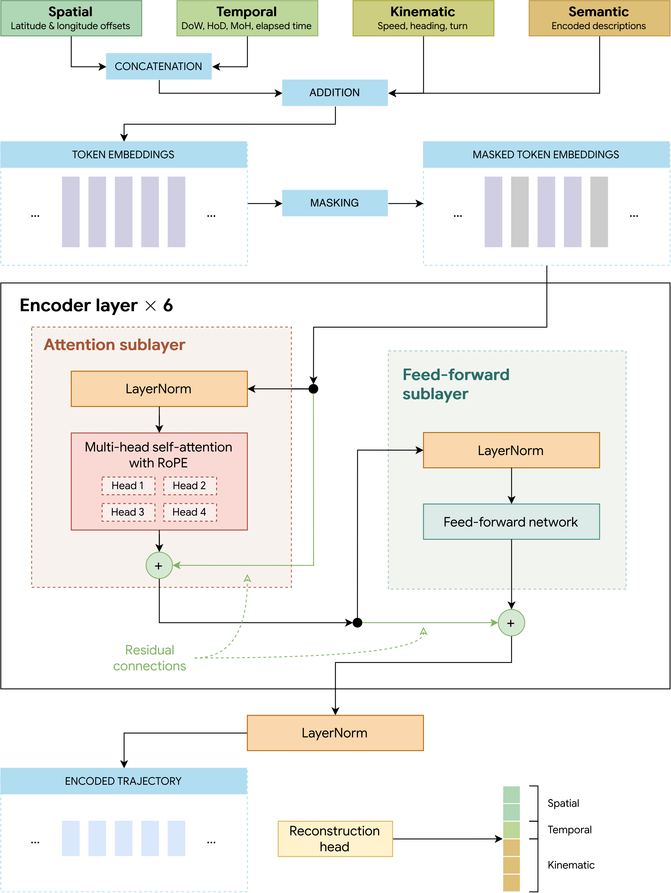

# A Semantics-Enriched Trajectory Foundation Model for Urban and Maritime Mobility

## Master's thesis

This repository holds the code of the Master's thesis

> Nhu Ngoc Hoang. *A Semantics-Enriched Trajectory Foundation Model for Urban and Maritime Mobility*.
> Master Thesis in Data Science, Department of Mathematics "Tullio Levi-Civita", University of Padova,
> academic year 2025–2026. Supervisor: Prof. Massimiliano de Leoni (University of Padova).
> Co-supervisor: Prof. Esteban Zimányi (Université Libre de Bruxelles).

The thesis is available in [`thesis/NhuNgocHoang_MasterThesis.pdf`](thesis/NhuNgocHoang_MasterThesis.pdf).
The code is a copy, with its history, of the repository
[nhungoc1508/master-thesis](https://github.com/nhungoc1508/master-thesis).

## End-to-end system overview

## Enrichment pipelines

## Transformer-based encoder

